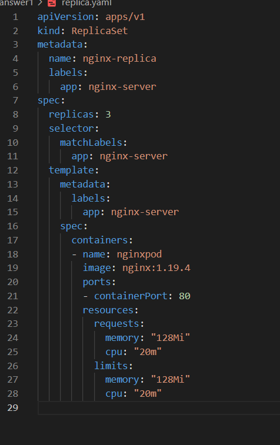
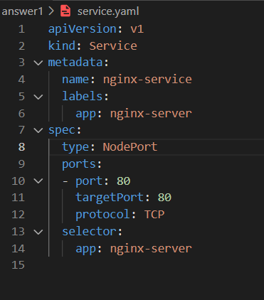
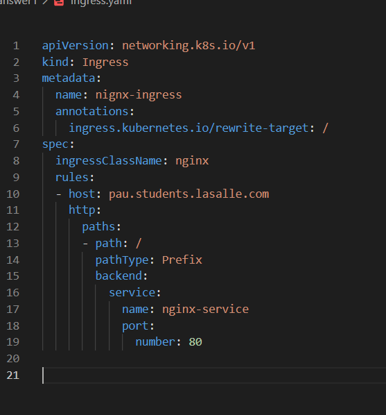
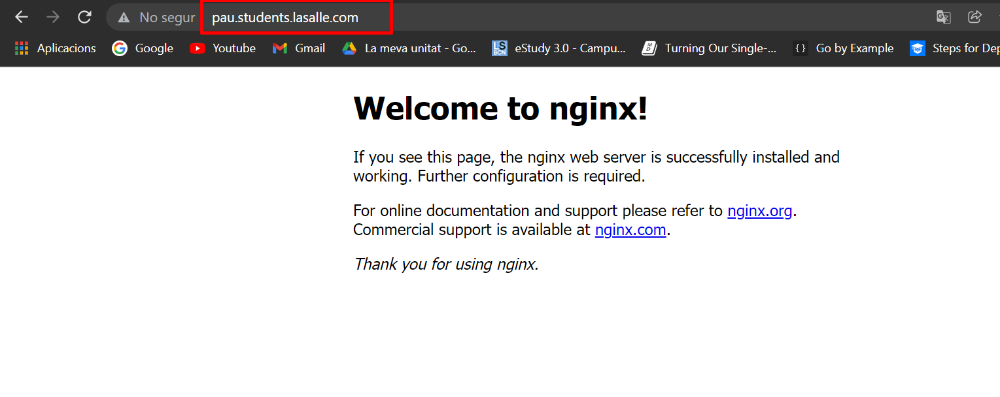
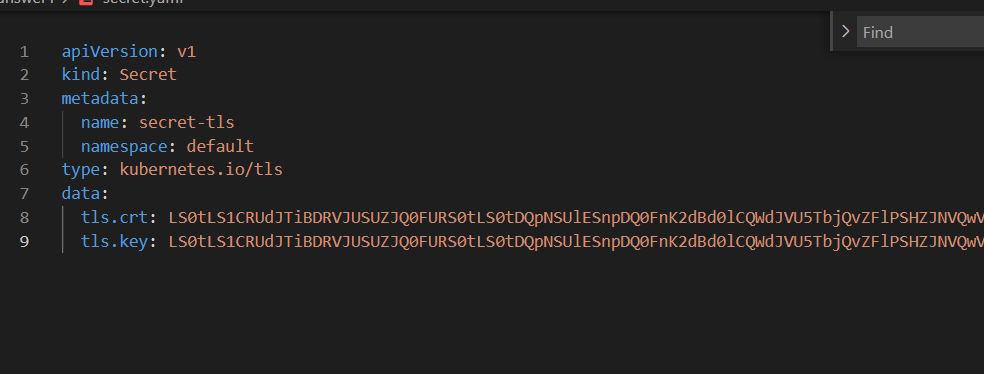
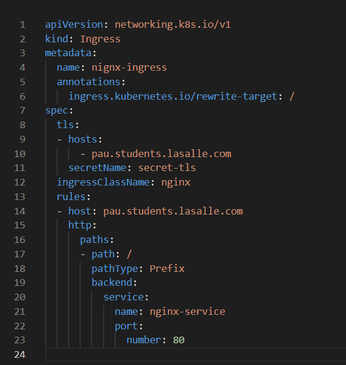
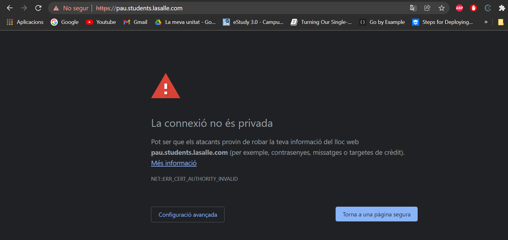
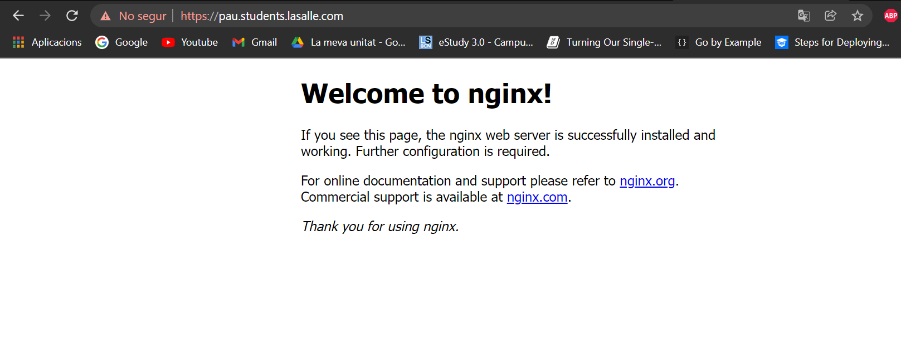

# Ejercicio 1

Primero voy a crear el escenario para el ejercicio con:

Un replicaset:

Un service:

Un ingress:

Una vez tengo esto, he modificado mi fichero de host añadiendo que en localhost puede tener el DNS pau.students.lasalle.com

Una vez realizado este paso gracias al ingres controler podemos acceder a este host:

Para proporcionar el servicio HTTPS tenemos que crear un secret y pasarlo los certificados creados con OpenSSL:

Una vez tengo el secret, lo relaciono con el ingres

Y ahora podemos acceder a https:
Validaremos que queremos entrar, y tendremos el contenido de nginx.

