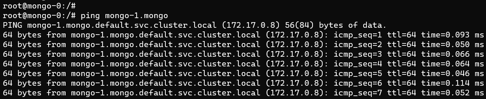

# Ejercicio 2

Primero voy a crear dos objetos, un statefullSet y un service para recrear el cluster de mongo:

Una vez tengo esto, puedo ver los pods y los nombres asignados:

Ahora, puedo entrar en uno de los pods y hacer un ping a otro de los pods del cluster:

Si a continuacion, entramos a mongo dentro del pod, con el comando mongo, y ejecutamos rs.status() podemos ver que no tenemos los miembros en el custer y podemos añadirlos manualmente con el replicaSet.

Para hacerlo utlizamos lo siguiente: Hacemos un rs.initiate() del primer mod, y añadimos los otros dos

Y ahora tenemos el cluster correindo, con los tres mongos correiendo, funcionanado todo en kubernetes con un statefulSet.

Una vez hecho esto, voy a entrar en uno de los mongos y ha crear una base de datos:

Ahora salimos de este mongo y vamos a otro. Una vez dentro entramos en mongo, y listamos el contenido bases de datos.
Como se puede ver, tenemos la base de datos creada en el primer mongo llamada Kubernetes, y si la seleccionamos y miramos su contenido, podemos ver que esta el objecto Pod que habiamos creado anteriormente.

---

A diferencia de un Deployment, un StatefulSet mantiene una identidad asociada a sus Pods. Estos pods se crean a partir de la misma especificación, pero no pueden intercambiarse. Cada uno tiene su propio identificador persistente que mantiene a lo largo de cualquier re-programación.

Los StatefulSets son valiosos para aquellas aplicaciones que necesitan almacenamiento estable y persistente, despliege ordenado, escalado y escalado, y actualizaciones en linia ordenadas. Si una aplicacion no necesita tener un identificador estable o despliegue, tu apliación se podría desplegar desde un conjunto de replicas sin estado, como un ReplicaSet, ya que son mejores para estos casos.
