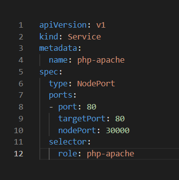
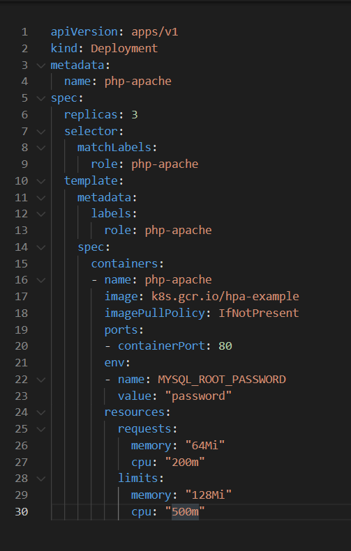
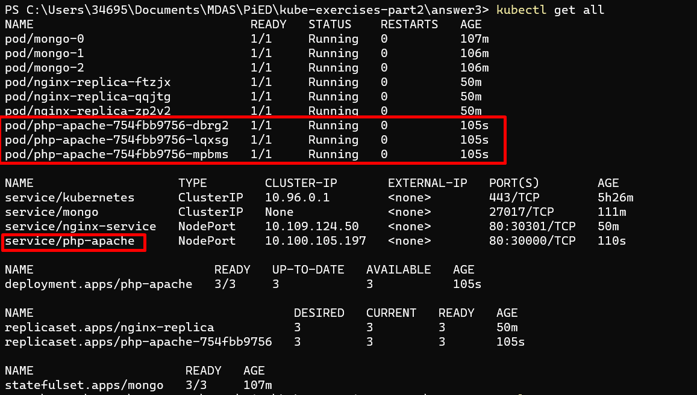
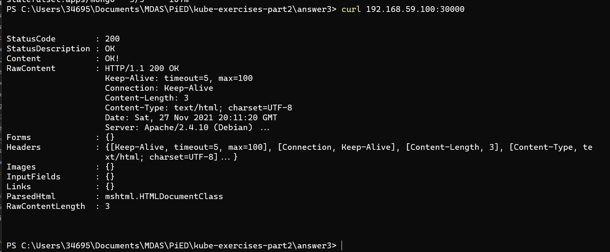
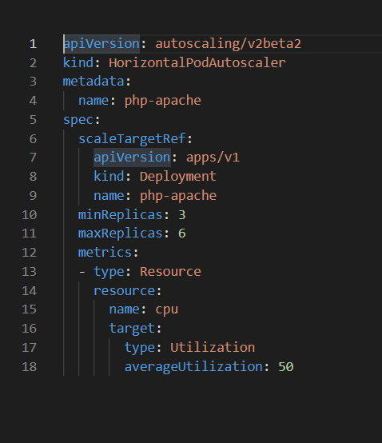
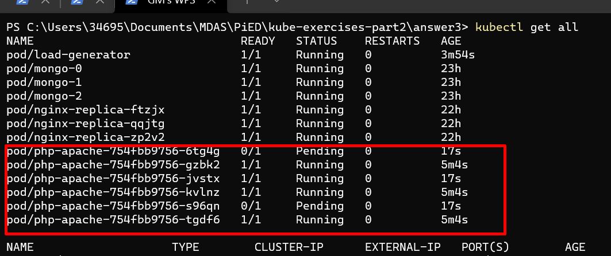

# Ejercicio 3

Para hacer este ejercicio he utilizado el siguiente escenario:

La imagen que estoy utilizando es de la documentacion de google y tiene un php-apache corriendo que tiene un index con un bucle y un echo, hecho especialmente para gastar CPU.

Si hacemos un get all podemos ver que tenemos 3 pods correindo y un service.

Si ahora hacemos un curl a la ip de minikube con el puerto 30000 nos responde con un echo de status 200 y el contenido que en este caso es "Ok!"

En este momento, para que funciona hpa necesitamos primero añadir el addons de matrics-server para que nosotros podamos llamar a el endpoint que nos proporciona y nos devuelva estadisticas de las metricas de los pods.

Una vez esto vamos a crear el hpa:

Este se encargará de crear o eliminar pods en base a la utilización de CPU del momento.

En el momento en que pasamos el umbral del 50% de uso de CPU, se nos crean el doble de pods.

